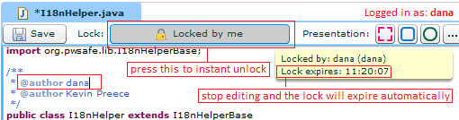
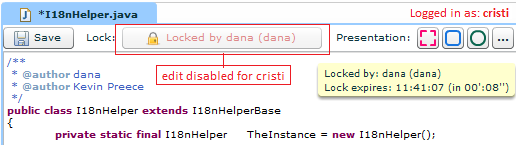
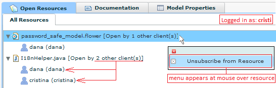



	<h1>Real Time Collaboration on Diagrams</h1>
    <ul class="breadcrumb">
	    <li class="active">Labels:</li>
	    <li>Implemented</li>
	    <a class="btn btn-success pull-right">Rate &amp; Discuss This Concept!</a>
    </ul>
    

The web (and mobile) version of Flower Platform allows people to collaborate in real time on any editor (diagram, code and other editors). Any modification made by one user is instantly propagated to the other people that view the same resource (diagram, file, etc.).

A temporary lock mechanism exists:

	 
	<em>User "dana" is editing the resource. I.e. the resource is temporarily locked by "dana"</em>  
	 
	<em>User "cristi" receives updates in real time. But he cannot edit the resource while it is locked by "dana"</em>

The *Open Resources* view shows which are the users that are viewing the current resource. 

	

