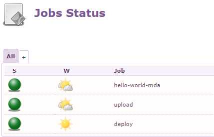
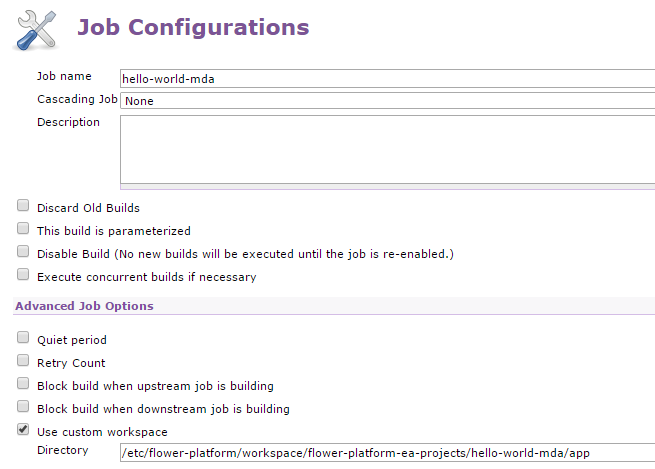
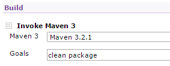
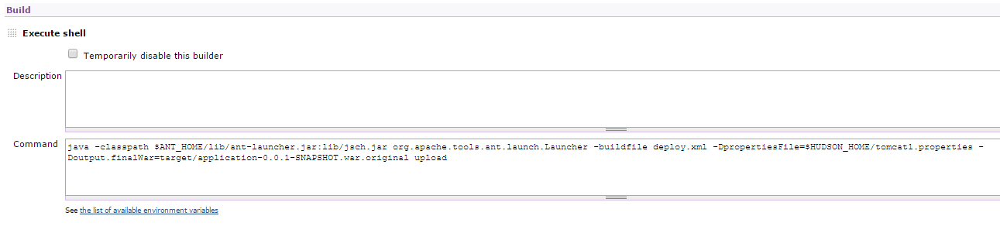
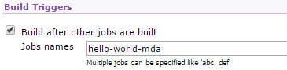
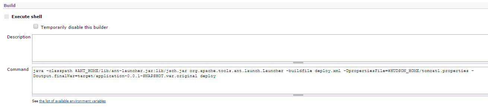
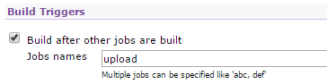



After generating the application following the MDA flow, we are ready to deploy it to our servlet container, using the deploy interface.

<!-- more -->

We will create three jobs, one for each step of the process: building the application, uploading to a remote machine and deploying to our servlet container.

## Build job

The build job is a simple job, with a custom workspace, pointing to the location of the generated project.

We add a build step which will invoke Maven. The project will be packaged as a ``.war`` file, ready to upload and deploy to our servlet container.

## Upload job

The upload job will invoke the ``upload`` target. We specify a properties file with our remote host information, and the name of the package that was previously built.

We can also set the upload job to run automatically after the build job.

## Deploy job

The deploy job will invoke the ``deploy`` target. The configuration is the same as for the upload job above. This job will deploy the newly uploaded package and restart our servlet container.

Similarly, the deploy job may be set to run automatically after the upload job.

The application is now available in our servlet container.

