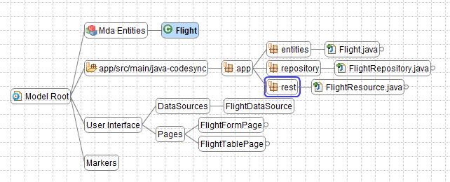
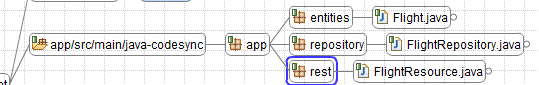



Flower Platform MDA, configured together with the Server/JavaEE + Client/Angular.JS petals can generate and deploy an enterprise application in minutes. And round-trip development flow is supported of course. I.e. when modifications are done in code, they are correctly understood by the system; on next generation, they will be preserved.

<!-- more -->

After creating a new project, the model looks like this:

Let's open the *markers* window (right click on the markers node > Markers). At the beginning, it's empty.

Now we open the entities diagram, by double clicking on the *Mda Entities* node. We can use ``CTRL + drag `` to create an entity.

We notice that the markers window is now populated. The MDA system has detected the newly added entity. But, on the other hand, it notices that corresponding elements are not yet created (e.g. a Java entity, a JS screen, etc.). It proposes "quick fixes" that will create the missing elements for us. 

We can click on **Auto Select and Apply Quick Fixes**, and wait for a few moments. We notice that the markers are gone. If we switch back to the main diagram, and we expand the Java/UI nodes, then we see that missing elements have been added.

**HINT**: We can right click on the **Mda Entities** node > **Force Expand/Collapse**

We notice the second node, ``app/src/main/java-codesync``. It has a yellow marker. This means that the changes have not yet written to the disk. Let's click on **Synchronize** and then on **Generate UI**. Now the markers are green, meaning that the code has been generated.

Let's add some attributes to the entity.

We notice that new markers have appeared. We click on **Expand All**, then **Auto Select...*. When they disappear, we click on **Synchronize** and then **Generate UI**. We can now import the generated project into Eclipse and run it.
