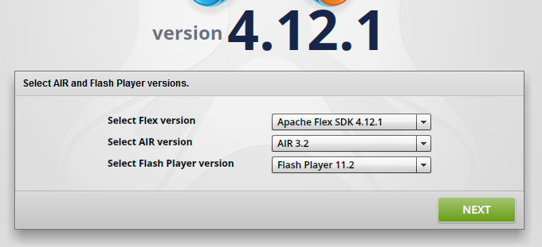
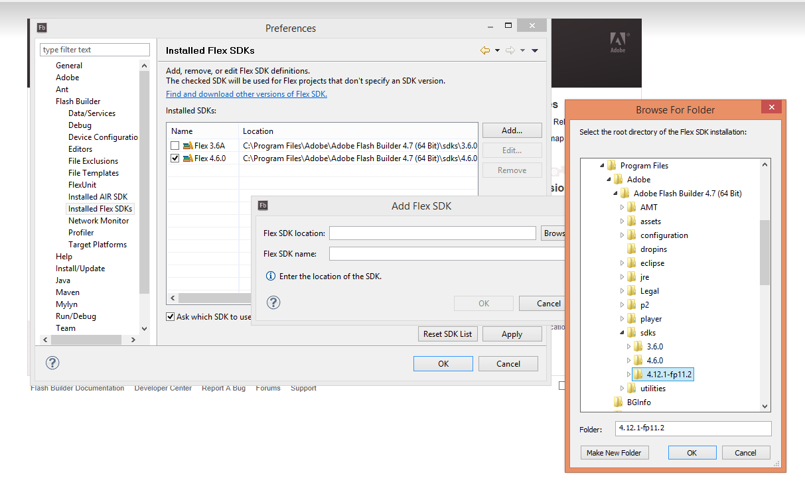



**Flower Platform** uses several technologies:

* server side: Java. We need to use the [Eclipse](http://www.eclipse.org) IDE.
* client side: [Apache Flex](http://flex.apache.org/) and JavaScript. We can use command line or one of the available IDEs: [Adobe Flash Builder](http://www.adobe.com/products/flash-builder.html), [Flash Develop](http://www.flashdevelop.org/) or [FDT](http://fdt.powerflasher.com/).

This guide helps us to **setup** a comfortable dev environment, to **import** the projects and to **run** Flower Platform.

<!-- more -->

## Java Development: IDE

We use Eclipse together with a few plugins. If we are starting from scratch, these are the steps to follow:

* **Eclipse:** We download the latest [Eclipse](http://eclipse.org/downloads/) (we recommend the *Eclipse Modeling Tools* version) and unzip it somewhere (and maybe rename it). E.g. ``D:\Java\eclipse_4.3.1_modeling_x64``.
* **Web Tools Platform** (WTP, for working with web applications): We usually install these plugins the "old" way. I.e. [download](http://download.eclipse.org/webtools/downloads/) the version corresponding to our version of Eclipse (e.g. latest version / *Traditional Zip Files* / *Tool Developers*), unzip, and copy the ``features`` and ``plugins`` dirs into Eclipse (e.g. ``D:\Java\eclipse_4.3.1_modeling_x64``).
* **m2e** (Maven integration with Eclipse): We install these plugins the "new" way (i.e. *Help / Install New Software... / click Add...*, cf. [using an update site](http://help.eclipse.org/juno/index.jsp?topic=%2Forg.eclipse.platform.doc.user%2Ftasks%2Ftasks-127.htm)). We use ``http://download.eclipse.org/technology/m2e/releases `` as update site (cf. [these m2e instructions](https://www.eclipse.org/m2e/download/)). Make sure that *Contact all update sites ...* is checked.
* **Ansi Console** (for seeing color log messages in the Eclipse console): We use the update site: ``http://www.mihai-nita.net/eclipse`` (cf. [here](http://mihai-nita.net/java/)).

## Flex Development: SDK

We download and install [Apache Flex Installer](http://flex.apache.org/installer.html). This is an utility that downloads and configures Flex SDKs.

Using the Flex Installer, download the latest Flex version **configured for Flash Player 11.2** (e.g. you can name the destination dir ``4.12.1-fp11.2``). 
Hint: If you install Flex somewhere within ``Program Files`` (cf. the 2nd image below), you may need to run the Flex Installer as admin.

Once downloaded, we need to **configure the SDK** into our IDE. E.g. for **Flash Builder**: *Window / Preferences / Flash Builder / Installed Flex SDKs / Add / Browse*, and then mark the newly added SDK as the default one.

## Cloning and Importing Projects

We clone the Flower Platform repository to our disk.

E.g. **from Eclipse:**

* we switch to the *Git* perspective
* from the *Git Repositories* view, we click on *Clone a Git Repository ...*. E.g. we put the repo in ``D:\data\git-repos\flower-platform-4``
* we right click on the **flower-platform-4** repo and then we click **Import projects**. We should select **all** the projects

E.g. **from Flash Builder:**

* we switch to the *Git* perspective
* this time, as the repo is already cloned, from the *Git Repositories* view, we click on *Add an existing Git Repository ...*
* this time, we need to import only a subset of the projects. I.e. ``org.flowerplatform.flex*``, **except** ``org.flowerplatform.flex_client.server``.

**IMPORTANT.** We will probably be using 2 IDEs: Eclipse (for Java Dev) and another one (for Flex Dev). We need to make sure that both of them are configured to **refresh the files automatically**. I.e. *Window / Preferences / General / Workspace / "Refresh Using native..."*

**HINT.** It's a good practice to close the the ``*.samples*`` projects, so that we don't waste time recompiling them each time a library is modified (e.g. ``flexdiagram`` or ``flexutil``). However, when doing extensive work inside one of the libraries, the ``*.samples*`` projects are handy, as we can test on sample test cases, instead of the whole Flower Platform application.

## Running Flower Platform

### One Time Operation: Set Target Platform

We open ``/org.flowerplatform.product/eclipse-4.3.2.target`` and we click *Set as Target Platform* (upper right corner). This operation will download the proper Eclipse plugins needed by Flower Platform.

### Rare Operation: Run the ``flowerplatform.product`` file

The **first time** or when the **set of plugins change** (e.g. after adding a new project), we open ``/org.flowerplatform.product/flowerplatform.product`` and we **run** it (upper right corner, the green play button. 

We need this step so that we can force Eclipse to write some config files for us (``...WORKSPACE/.metadata/.plugins/org.eclipse.pde.core/flowerplatform.product``). Therefore, right after running the application, we can close it (e.g. from the *Console* View / Stop button).

**HINT.** The console will probably display some exceptions (something about ``javax.servlet.*`` classes not being found). This is **not an issue**, as we perform this step only to have the config files written for us.

**IMPORTANT.** After running the application, a launch config is automatically created (available under the general *Run* or *Debug* menus from the action bars). We **shouldn't** use the **generated launch config**; we should **always** run the application from the ``flowerplatform.product`` file.

### Starting the Server

The entry point of Flower Platform is ``org.flowerplatform.host.web_app``. Being a web project (WTP) we should launch it as a **web project**. More info about configuring, launching and working with web projects is found [here](TODO).

We recommend to always start the server in **Debug** mode, and take advantage of the **hot code swap** technique (cf. [this doc](TODO)), in order to be productive when writing and modifying Java code.

**Flower Platform** should be available now at [http://localhost:8080/org.flowerplatform.host.web_app](http://localhost:8080/org.flowerplatform.host.web_app).

**HINT.** If we use Flash Builder, we can use ``/org.flowerplatform.flex_client.host_app/launch_configs/Flower Platform - Flex Client Host App (Web).launch``. I.e. right click and *Run as* or *Debug as*, or running from the general *Run* or *Debug* menu. This launch config is particularly useful for **debugging** the Flex client app.

