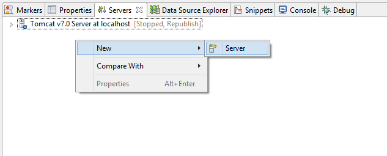
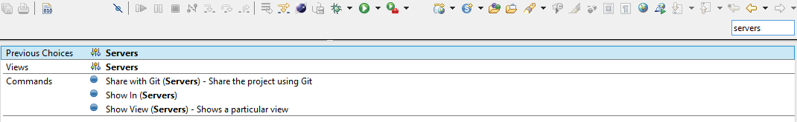
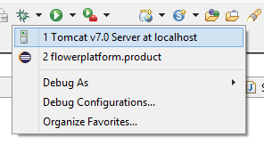
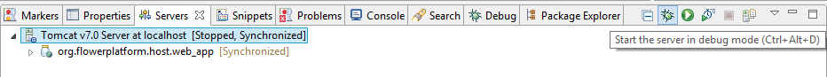
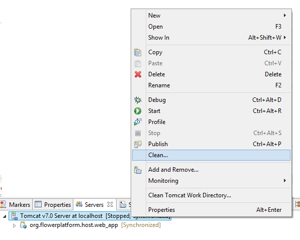



## Server Configuration

In the following we will show how we configured the server for our application. The server used is **Apache Tomcat v7.0**, which can be downloaded from [here](http://tomcat.apache.org/download-70.cgi).

The topics covered in this part are:

* [Adding the server](WTP.html#adding_the_server)
* [Running the server](WTP.html#running_the_server)
* [Hot Code Swap](WTP.html#hot_code_swap)
* [Deployment assembly](WTP.html#deployment_assembly)
* [Useful for troubleshooting](WTP.html#troubleshooting_hints)

<!-- more -->

###  Adding the server

In order to add a new server, right click on the **Servers** area, then choose ``New > Server``. 

 

A wizard will appear, which will guide you through the rest of the process. From the **Apache** category, choose your server version and click **Next**.

	

		<strong>IMPORTANT.</strong>
		For the next step, the <code>org.flowerplatform.host.web_app</code> web project must be moved from the <strong>Available:</strong> category to the <strong>Configured:</strong> category, as shown below.
	

 

**HINT.** Sometimes the **Servers** view may not be visible and it may be needed to have quick access to it. In order to achieve this, you can type _Servers_ in the _Quick access_ text input from the toolbar.

 

###  Running the server

As also mentioned [here](../dev-doc/setup-dev-environment.html) in the _Starting the server_ area, we recommend to start the server in **Debug** mode. This can be done either by:

* clicking on the **Debug** option from the top bar and then choosing _Tomcat v7.0 Server on localhost_
	 
	
**or**

* selecting from the **Servers** view the server and then clicking on **Start the server in debug mode** button. 
	 

**HINT.** A useful configuration that we use is to set the IDE to **launch the previously launched application** (details about the steps needed to achieve this are given [here](./configure-workspace.html#always)). In this way, we can press **F11** and run the application in **Debug** mode directly. 

###  Hot Code Swap

In order to take advantage of the _Hot Code Swap_ technique (described in details [here](./#DisplayViewHotCodeReplace)), we must first configure the server not to reload itself automatically when changes are made in the code. For that, we perform the following steps:

1. go to the **Servers** view
2. double-click on the server (**Tomcat** in our case)
3. click on the **Modules** tab
4. select the <code>org.flowerplatform.host.web_app</code> project from the list
5. click on **Edit**
6. from the popup that appears, uncheck **Auto reloading enabled**
7. click on **OK**

 

###  Deployment assembly

There are two types of classpaths that need to be taken into consideration when developing an application: runtime and compile-time classpath. 

* **compile-time classpath** contains the classes that were added in the IDE in order to compile the code
* **runtime classpath** contains the classes that are used when the application is running

In our case, we need to tell **Eclipse** which files will be deployed to the **Tomcat** server. To do that, we use the **Deployment assembly** option: 

* right click on the <code>org.flowerplatform.host.web_app</code> project, then **Properties** and in the appearing popup **Deployment assembly**. Click on the **Add** option and follow the wizard to add the <code>org.flowerplatform.host.servletbridge.base</code> project to the dependencies.

###  Useful for troubleshooting

Note that when **Publish** is made (either _manual_ - by right clicking on the server and selecting **Publish** or _automatically_ - by going to ``Window > Preferences > Server > Launching`` and checking ``Automatically publish when starting servers``), the content of the **WebContent** folder from the <code>org.flowerplatform.host.web_app</code> project is copied in your workspace here: <code>path_to_workspace\.metadata\.plugins\org.eclipse.wst.server.core\tmp0\wtpwebapps\org.flowerplatform.host.web_app\</code> (e.g. in our case <code>d:\data\java_work\eclipse_workspace\flower-platform-4\.metadata\.plugins\org.eclipse.wst.server.core\tmp0\wtpwebapps\org.flowerplatform.host.web_app\</code>)

Sometimes it happens that the Eclipse IDE is malfunctioning. The first things we could do in order to make it functioning again is:

* **check the content** of the above mentioned folder to see if it is the one we expected to be

**or**

* **clean the server**. This is done by right-clicking on the **Server** and selecting **Clean**

