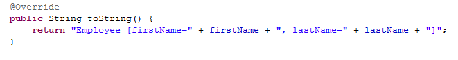
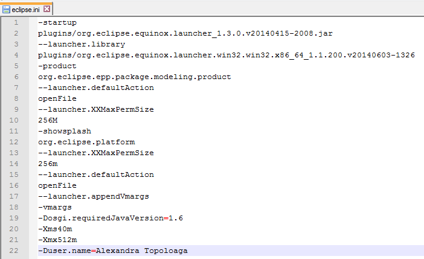



In order to configure the workspace, we can do several things like:
<ul> 
<li> <a href="#showHeap">Show heap</a> </li>
<li> <a href="#setLineWidth">Set line width</a> </li>
<li> <a href="#always">Always launch the previously launched application</a> </li>
<li> <a href="#addAuthor"> Add author from eclipse.ini</a> </li>
<li> <a href="#showLineNumbers"> Show line numbers</a>  </li>
<li> <a href="#formatText"> Format Text</a>  </li>
</ul>

<!-- more -->

<a name="showHeap"/>

## Show Heap 

### Why?

It is important for programmers to be able to check how much **memory** is used. This fact tells us when to allocate more space (e.g. we run a large project and Eclipse may run out of memory) or even better, optimize some processes.

### How?

In the menu *Window / Preferences / General* we check the box afferent to **"Show heap status"**.

<strong>Hint:</strong> Once you open the window, you can use the keyboard: ARROW KEYS, SPACE and then ENTER.

Now the status of the heap can be seen in the lower right corner. The left part shows how much heap is used and the right part shows how much heap is available. We can also see the maximum size of the heap. There is also an icon which allows us to run the garbage collector manually.

If we want to modify the size of the heap, we have to modify the **eclipse.ini** file. We can find it in our **eclipse** folder (e.g. ``D:\Java\eclipse_4.4_modeling_x64``).
The only line we have to modify is the one starting with **-xmx**  (e.g. changing ``-Xmx512m`` in ``-Xmx1024m`` will increase our heap memory from 512 MB to 1024 MB).

<a name="setLineWidth"/>

## Set line width

### Why?

We can modify the default line width in Eclipse so the code can be formatted the way you want ( e.g. ``if a method has a long declaration, it can be split in two or many lines and we may want to see it in only one - see the pictures below``).

 Line width: 80
 Line width: 180

### How?

In the menu *Window / Preferences / Java / CodeStyle / Formatter* we have to make a new **Active profile** which will be initialized from an existent profile.

In order to edit the profile created, we have to press the **edit** button, go to the tab **Line wrapping** and modify the input from the textbox corresponding to **Maximum line width:**.

<a name="always"/>

## Always launch the previously launched application

### Why?

We may have wanted sometime to run once again the last application launched in Eclipse and discover that the one that is running is another one.

### How?

In the menu *Window / Preferences / Run/Debug / Launching* we have to check the option **Always launch the previously launched application**

We can now use CTRL + F11 or F11 without worry.

<a name="addAuthor"/>

## Add author from eclipse.ini

### Why?

In **eclipse.ini** file we can add details like maximum heap size or author. 
If we add the author in this file we can use the shortcut SHIFT + ALT + J to add the author of a class.

### How?

We have to modify the **eclipse.ini** file. We can find it in our **eclipse** folder (e.g. ``D:\Java\eclipse_4.4_modeling_x64``).
All we have to do is to add (or edit) one line (see the picture below).

<a name="showLineNumbers"/>

## Show line numbers

### Why?

Displaying line numbers can be very useful for debugging code errors.

### How? 

We can do this in two ways: 

* We can either right click in the right side of our code and select **Show line numbers** 

* Or we can go to the menu *Windows / Preferences / General / Editors / Text* Editors and check the option **Show line numbers**

If we want to go to a specific line in our code we can use the shortcut CTRL + L 

<a name="formatText"/>

## Format text

[See format code](index.html#FormatCode)
