

## Why?

* **Debugging** allows us to run a program interactively while ``watching the source code`` and the variables during the execution.

* By **breakpoints** in the source code we specify where the execution of the program should **stop**. To stop the execution only if a field is read or modified, we can specify **watchpoints**.

* **Breakpoints** and **watchpoints** can be summarized as stop points.

* Once the **program is stopped** we can investigate ``variables, change their content, etc``. 
	
## How?
* <b>First step:</b> We must set **breakpoints**. To set breakpoints in our source code we can *right-click* in the small **left margin** in our source code editor and *select* ``Toggle Breakpoint``. Alternatively we can *double-click* on this position or we can press CTRL+SHIFT+B.
	
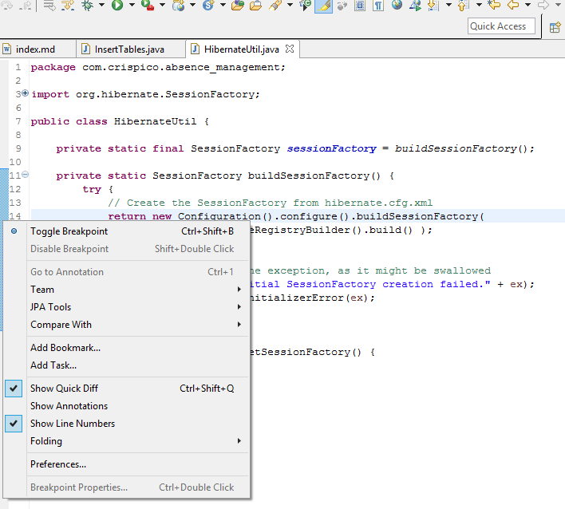

**The Breakpoints view** allows us to delete and deactivate stop points, i.e. ``breakpoints and watchpoints`` and to modify their *properties*. 

We can *uncheck* the **breapoints** we want to skip or to **skip all**:

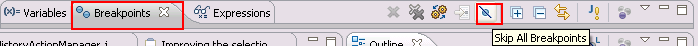

* <b>Second step:</b> We press the **debug arrow button**, as we can see in image below, and select our **Run Configuration**:

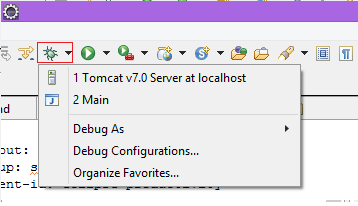

<h4><b>Warning:</b>  If we have not defined any breakpoints, this will run our program as normal.</h4> 

* <b>Third step:</b> After we pressed *debug button*, Eclipse asks us if we want to switch to the **Debug perspective** once a stop point is reached. Answer Yes in the corresponding dialog. 

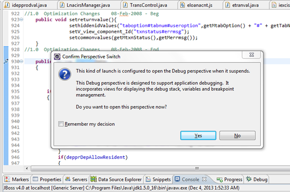

* <b>Fourth step:</b> We can now **debug** our *code*:

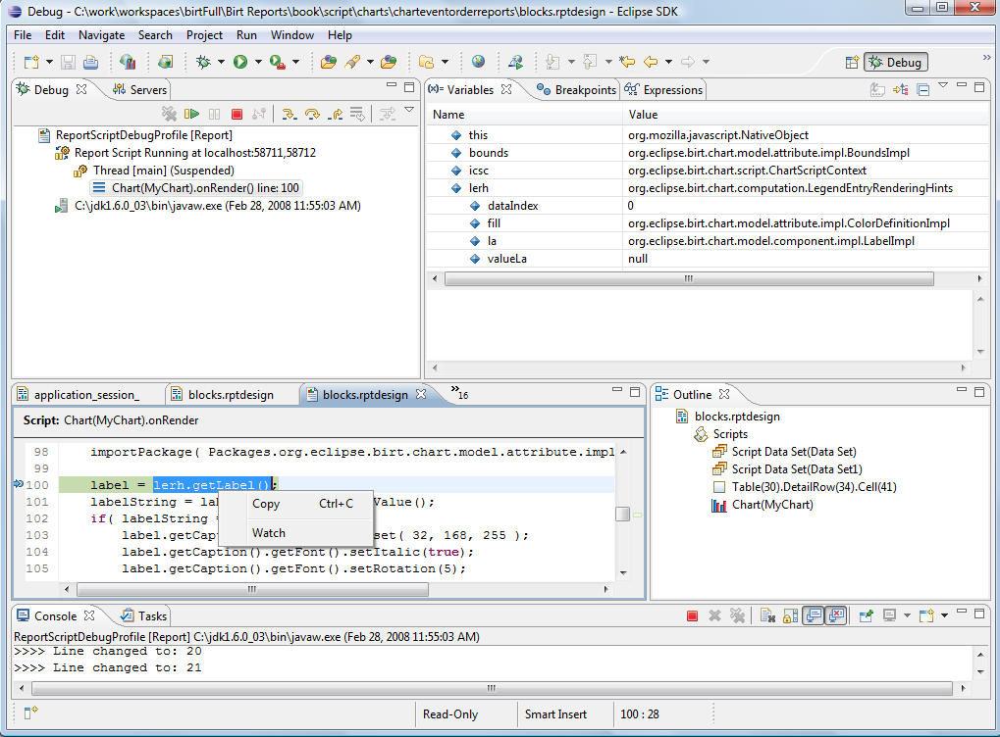

* <b>Fifth step:</b> To ``debug``, we must know how to control the program:

We can use the F5, F6, F7 and F8 key to **step** through our *coding*. The **meaning** of these *keys* is explained in the following **table**:

 
 
**The following picture** displays the **buttons** and their related ``keyboard shortcuts``:
 
 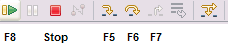
 
* <b>Sixth step:</b> We can evaluate variables from **Variables view** which displays ``fields`` and ``local variables`` from the current executing **stack**.
<h4><b>Info:</b> We need to run the <b>debugger</b> to see the variables in this view.</h4> 
 
 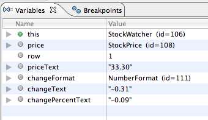

**The Variables** view allows you to ``change the values`` assigned to your *variable* at runtime:

##Remote debugging 

* **Step 1**: We need to go to Run -> Debug Configurations:

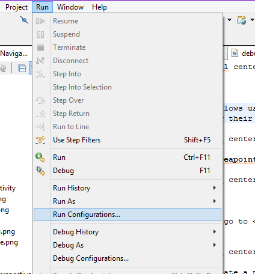

* **Step 2**: Then we create a new ``Remote Java Application configuration``:

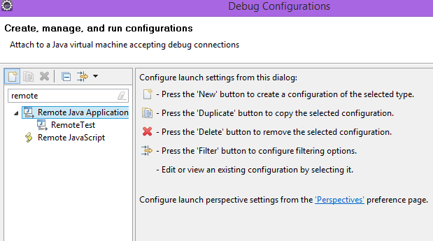

* **Step 3**: We ``configure`` the remote application's **details**:

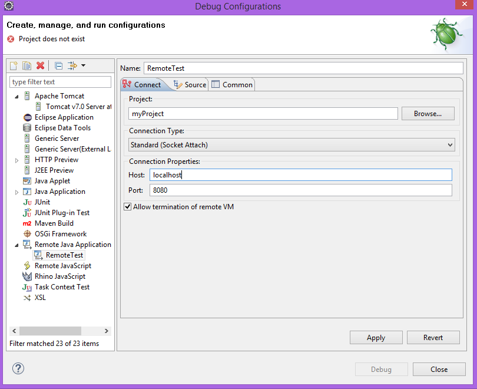

* **Step 4**: We add this **launch configuration** to ``favorites menu``: 

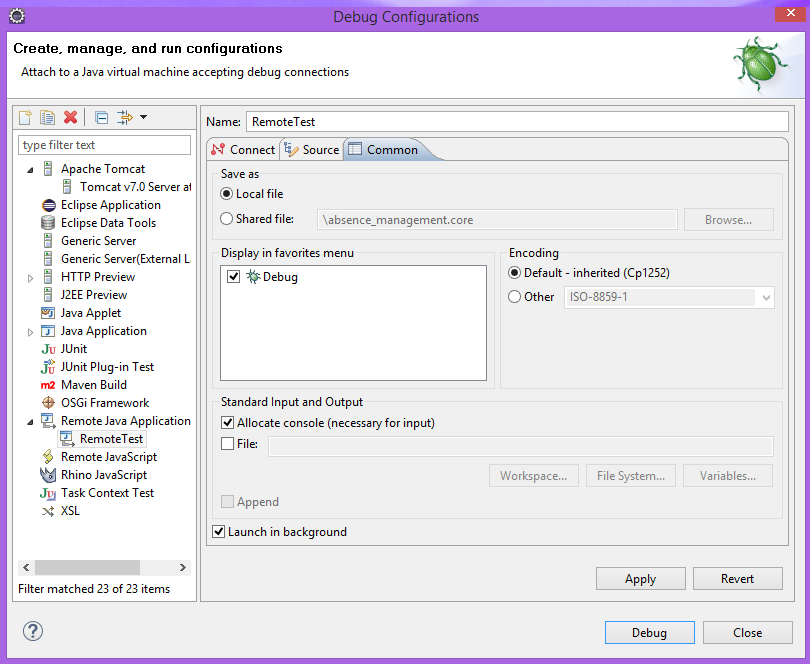

<h4><b>Warning:</b>Remote debugging requires that we have the project which is debugged, available in our Eclipse. </h4> 
