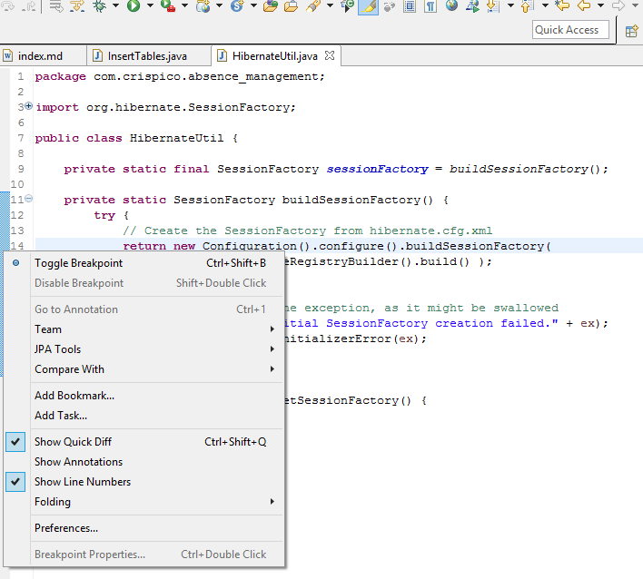
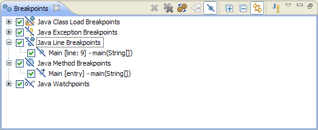
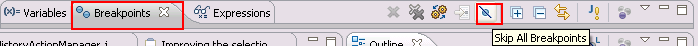
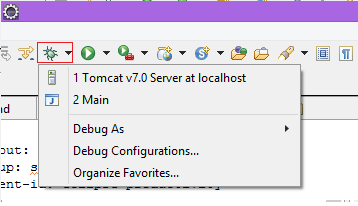
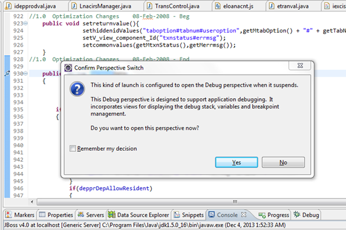
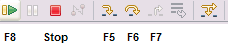
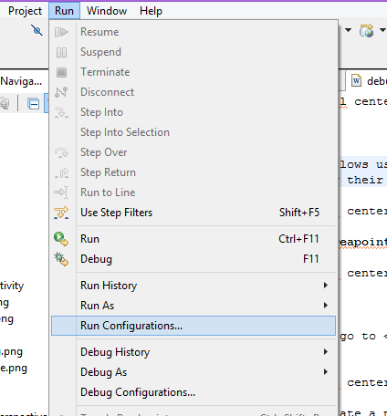
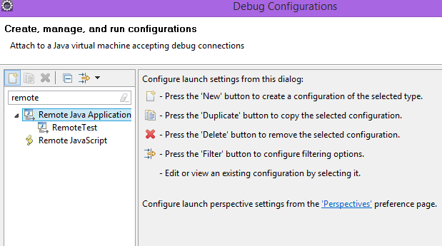
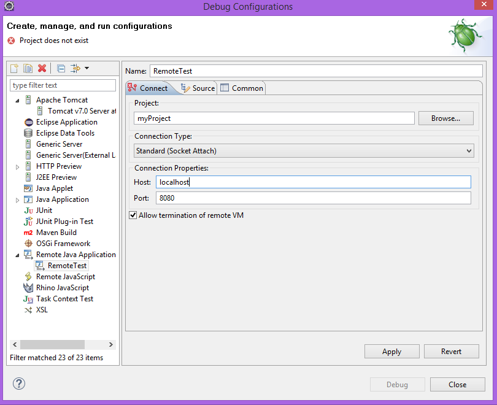
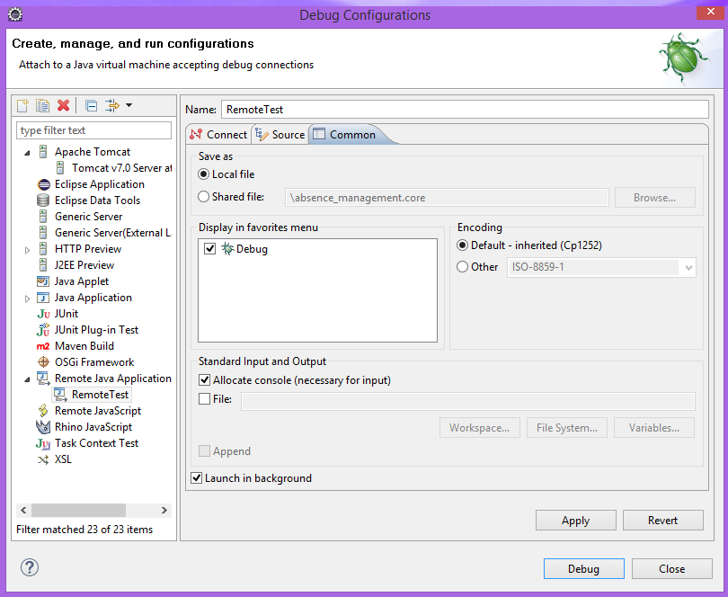



## Why?

* **Debugging** allows us to run a program interactively while ``watching the source code`` and the variables during the execution.

* By **breakpoints** in the source code we specify where the execution of the program should **stop**. To stop the execution only if a field is read or modified, we can specify **watchpoints**.

* **Breakpoints** and **watchpoints** can be summarized as stop points.

* Once the **program is stopped** we can investigate ``variables, change their content, etc``. 
	
## How?
* <b>First step:</b> We must set **breakpoints**. To set breakpoints in our source code we can *right-click* in the small **left margin** in our source code editor and *select* ``Toggle Breakpoint``. Alternatively we can *double-click* on this position or we can press CTRL+SHIFT+B.
	

A breakpoint is <strong>installed</strong> if the class has been loaded in the target VM and a breakpoint request has been successfully created at the desired location. If so, a <strong>checkmark</strong> will appear on the breakpoint

**The Breakpoints view** allows us to delete and deactivate stop points, i.e. ``breakpoints and watchpoints`` and to modify their *properties*. 

We can *uncheck* the **breakpoints** we want to skip or to **skip them all**:

* <b>Second step:</b> We press the **debug arrow button**, as we can see in image below, and select our **Run Configuration**:

<h4><b>Warning: </b>  If we have not defined any breakpoints, this will run our program as normal.</h4> 

* <b>Third step:</b> After we pressed *debug button*, Eclipse asks us if we want to switch to the **Debug perspective** once a stop point is reached. Answer Yes in the corresponding dialog. 

* <b>Fourth step:</b> We can now **debug** our *code*:

* <b>Fifth step:</b> To ``debug``, we must know how to control the program:

We can use the F5, F6, F7 and F8 key to **step** through our *coding*. The **meaning** of these *keys* is explained in the following **table**:

 
 
**The following picture** displays the **buttons** and their related ``keyboard shortcuts``:
 
 
 
* <b>Sixth step:</b> We can evaluate variables from **Variables view** which displays ``fields`` and ``local variables`` from the current executing **stack**.
<h4><b>Info:</b> We need to run the <b>debugger</b> to see the variables in this view.</h4> 
 
 

**The Variables** view allows you to ``change the values`` assigned to your *variable* at runtime:

##Remote debugging 

* **Step 1**: We need to go to Run -> Debug Configurations:

* **Step 2**: Then we create a new ``Remote Java Application configuration``:

* **Step 3**: We ``configure`` the remote application's **details**:

* **Step 4**: We add this **launch configuration** to ``favorites menu``: 

<h4><b>Warning: </b>Remote debugging requires that we have the project which is debugged, available in our Eclipse. </h4> 

When remote debugging, you must pay attention to the situations when a different process is being launched (e.g. Tomcat server launches Hudson continuous integration tool, which launches an Ant build script wich launches Maven). In that case, you  must specify the debug options to Maven: add the <strong>Xdebug</strong> and <strong>Xrunjdwp:transport=dt_socket,server=y,address=5001,suspend=y</strong> parameters to Maven in your build script. Then you can debug the application using the 5001 port.

##For more setup see:

* [Setup Development Environment](../dev-doc/#SetupDevelopmentEnvironment)
 
* [Configure WTP](index.html#WTP)

