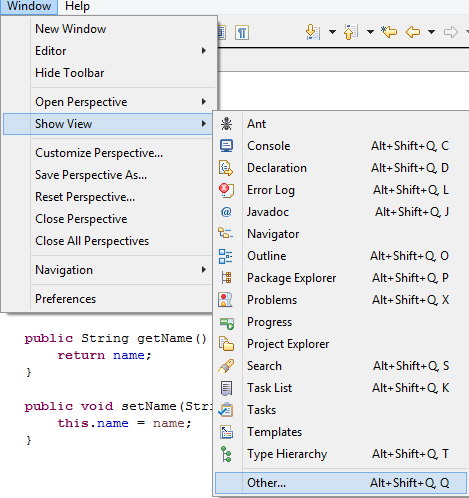
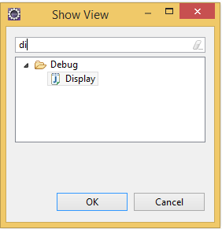
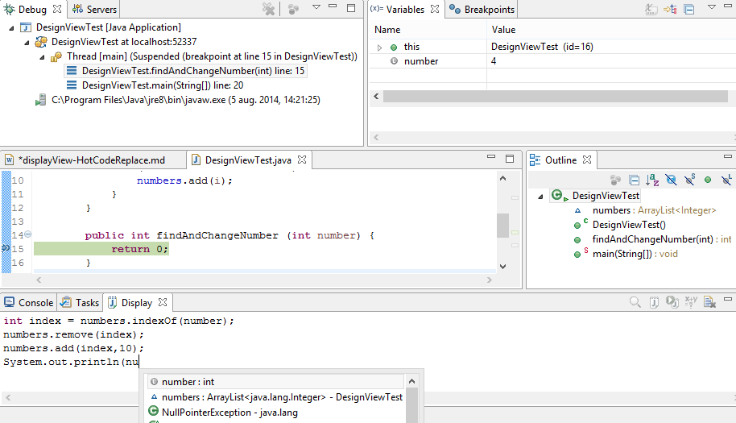
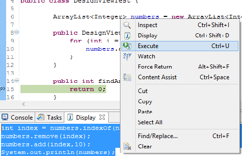
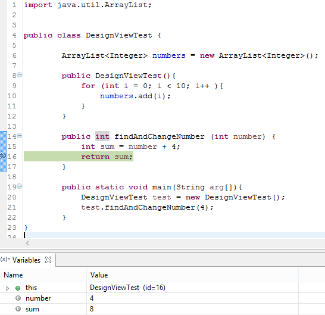
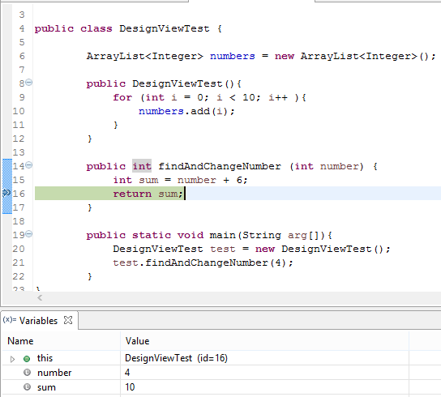



### **Design View**

The Debug perspective in Eclipse can open a **display view** that allows to enter some code for execution when we hit a breakpoint and so, we dinamically execute code related to the variables that are in scope.

<!-- more -->

#### How?

To open this view, select **Window / Show View / Other**(ALT + SHIFT + Q,Q) **/ Display**

 

 When the debugger hits a break point, we can type some code in the *Display view*. The code is executed within the context of the current debugging positions, which means that we can use **all the variables** and even **content assist**.

 

 To execute our code just <code>select</code> it and <code>use the context menu</code> or CTRL + U (execute) or CTRL + SHIFT + I (inspect).

 
 

<strong>Hint:</strong> To evaluate expressions in the editor in the Debug perspective, select the entire line where the breakpoint is set, and from the context menu, select the <strong>Inspect option</strong> (CTRL + SHIFT + I) or <strong>right-clicking</strong> on the variable we are interested in.
 

### **Hot Code Replace**

**Hot Code Replace** lets us make changes to a Java class and see the effect immediately in a running JVM without restarting our application.

#### How it works?

If we debug a class in Java we can make changes to it without restarting JVM (*e.g: try setting a breakpoint on the second line of findAndChangeNumber(). Next, change the number to a new value. Save the file and the program will continue running with the new code*)

 

####  Configuring TomCat Server

To see how to configure TomCat Server search [here](../WTP.html#hot_code_swap)

