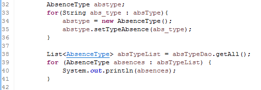
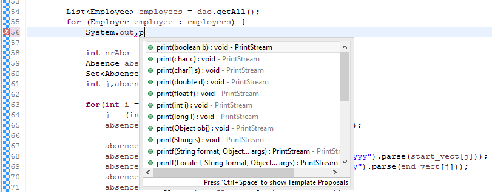
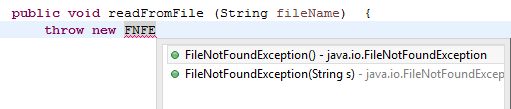
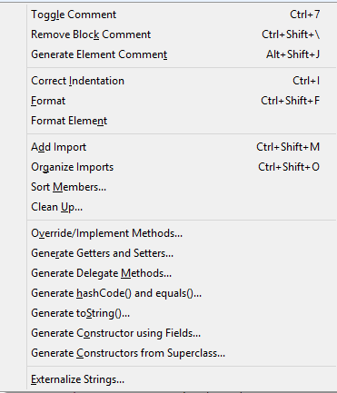



### Ctrl + Click

When we work with larger files or anything with long methods, it can get extremely annoying to see where some variables are declared.All we have to do is hold to CTRL down and click the hyperlinked variable, method or class to see their source.

 

### Letters + Ctrl + Space

You can use <code>content assist</code> to speed up the creation of fields, method parameters and local variables. With the cursor positioned after the type name of the declaration, press Ctrl+Space.

 

 Code completion supports <code>camel case</code> patterns.It is useful to search using only first letters or some letters from the name (e.g completing on **_FNFE_** or **_FiNoFoE_** will propose **_FileNotFoundException_**)

 

### Alt + Shift + S

Alt + Shift + S shows the Source Menu which includes menu options.                  
Some of the menu options have direct shortcuts (e.g **format** - Ctrl + Shift + F ), but a lot of the generate commands don't,so we must press the *underlined letter* that appears on menu options (e.g: **generate getters and setters** - R, **generate constructors using fields** - O)

  

