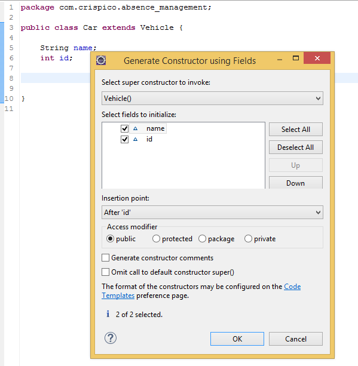
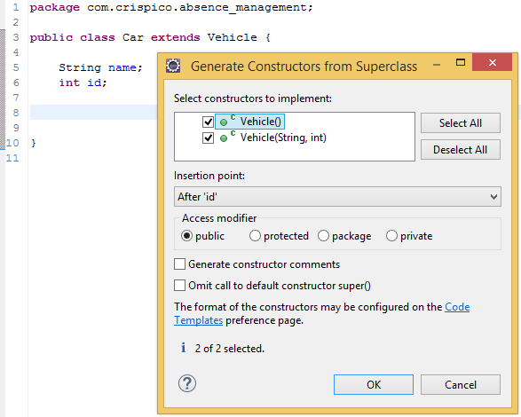


 
In Java we often need to add a **constructor** to a class based on some/all of its fields or even based on constructors of its superclass.
There are two features to help us generate these **constructor** instantly: *Generate Constructor using Field* and *Generate Constructors from Superclass*.

<!-- more -->

## How?

 **Generate a constructor using Field**

Right click / Source (ALT + SHIFT + S) / Generate a constructor using Field (O)

   
 **Generate Constructors from Superclass**
 
 Sometimes we will want to reimplement some/all of a superclass's constructors.To do this, Right click / Source (ALT + SHIFT + S) / Generate a constructor from superclass (C)

 