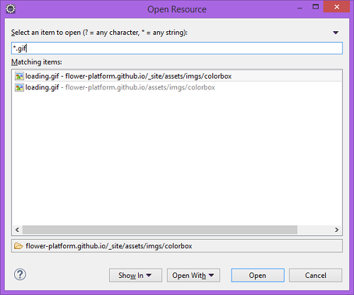
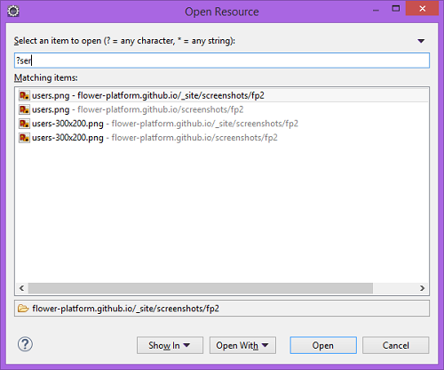
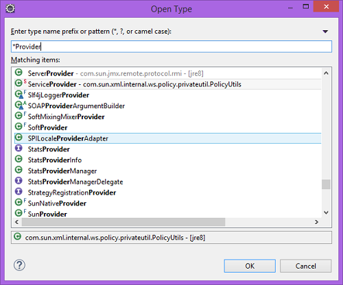
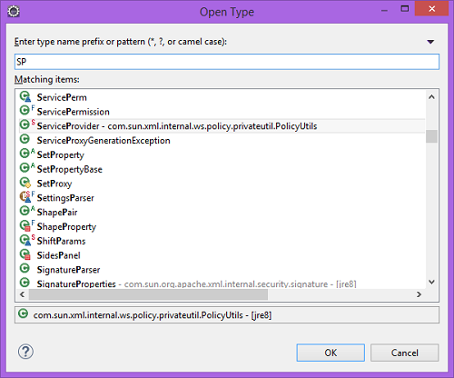
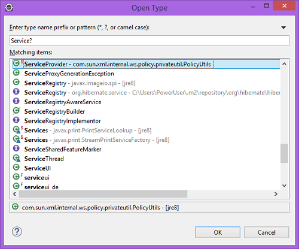



## Why?

Because we can *easily* access a ``source code file`` without searching all project **hierarchy**.

## How?

We can use ``Open Resource`` (CTRL + SHIFT + R) :

Or, if we want to search for a **type**, we use ``Open Type`` (CTRL + SHIFT + T) :

