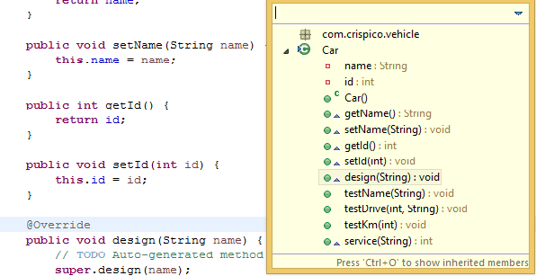
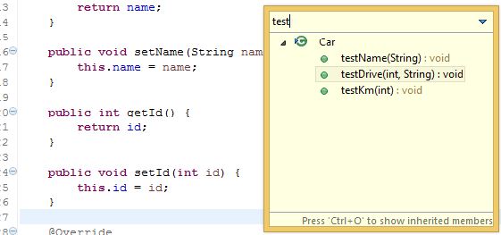
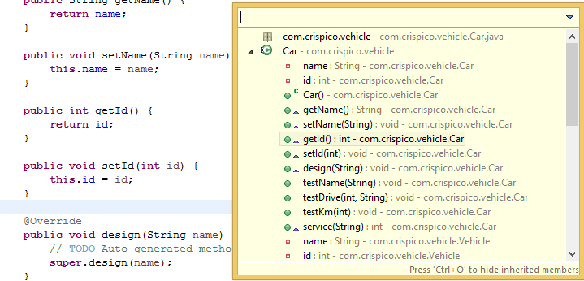



The **Outline view** displays an outline of structured file that is currently opened in the editor area and lists 
structural elements.It is very useful for jumping between sections in a class, or finding that one method we want to get to.

<!-- more -->

##How?

CTRL + O shows the methods and properties of a class. We can start typing to filter and hit enter to jump to a particular signature/type.
 

 

 
  Pressing again, CTRL + O lists including inherited methods.
 
 
