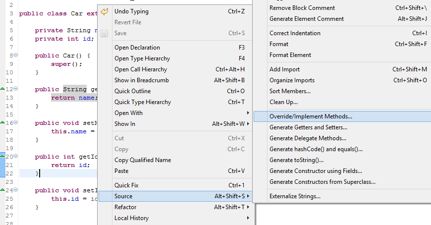
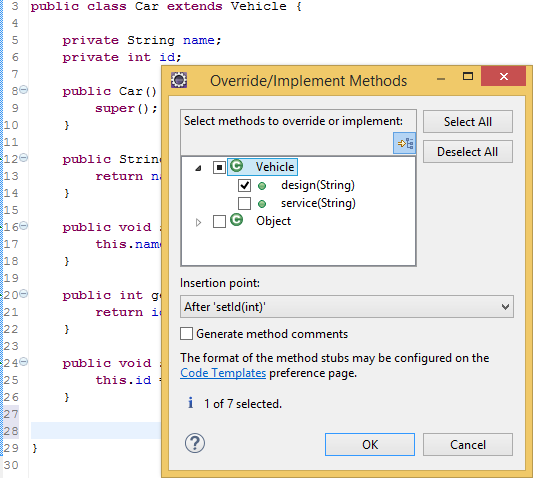
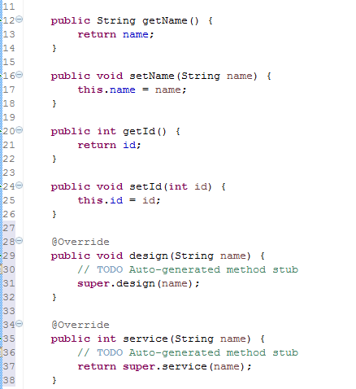



If a class inherits a method from its super class, then there it is a chance to **override** the method.
The benefit of **overriding** is the ability to <code>define a behavior</code> that is specific to the subclass type 
which means a subclass can implement a parent class method based on its requirement.

<!-- more -->

## How?

Right click / Source (ALT + SHIFT + S) on any space on your source code and invoke Override / Implement Methods (V) (e.g: we want to **override** the method *design()*).

 

 We can select the desired method(s) to be inserted and also the insertion point, click OK. 

 

