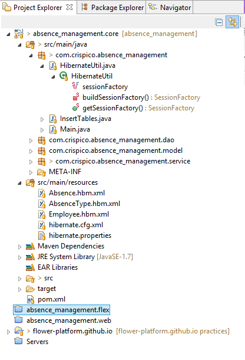
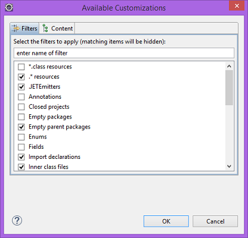
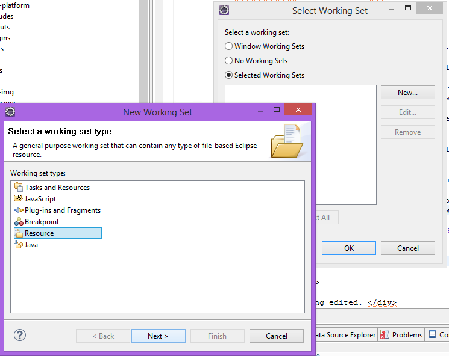
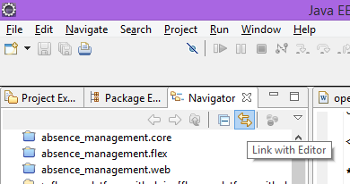



## Why?

We need **tree views** to see our *projects* and their hierarchy.

## How?

We can open a ``view``, by typing in **"Quick Access"** view we want :
	

	
**Project Explorer** is the most ``extensible`` view and allows proper viewing of *multiple files* with **different programming languages**. 

A typical *Project Explorer* with only the **Java Development Tools** (JDT) installed looks similar to the ``Package Explorer``.

We can filter the **Project Explorer** view to hide ``projects, folders, or files`` that we do not want to see.

To *enable or disable* filters, we complete the following **steps**:

   Open the *Filters* window by selecting **Customize View...** from the ``drop-down menu`` at the **top right corner** of the view.
   On the **Filters tab**, we select the check boxes next to the filters we want to enable. (*e.g. when the Closed projects filter is enabled, closed projects are not shown in the Project Explorer view*) 
	

	
**Package Explorer** view is *older* and is focused only on ``java files``.

*Package Explorer* also has the option of ``filtering`` only unlike the Project Explorer it is called **Filters** not *Customize View*. The steps are the same.
	

	
**Navigator** view provides a hierarchical view of the resources in the Workbench including **hidden files**, which *Project and Package Explorer* do not show.
	
*Navigator*, like the *Package Explorer*, it has the same ``filtering`` option with the same **steps**.

<strong>Warning!</strong> It is recommended the <i>removal of all filters</i> in the Navigator to display all files on the disc. 

* *A Working Set* is a subset of our **Eclipse projects**. We can create different *Working Sets* and then select which Working Set to display in the **Navigator view**.

To create a **Working Set**, we can click the ``small downward arrow`` in the **upper right corner** of the *Navigator* view and go to **'Select Working Set...'**. 

After we click **Next**, we can select the *projects* we want the ``working set selected`` to have.

* *Link with Editor*: When this option is ``selected``, changing the active editor will automatically update the *Project Explorer/Package Explorer/Navigator* selection to the resource being **edited**.

