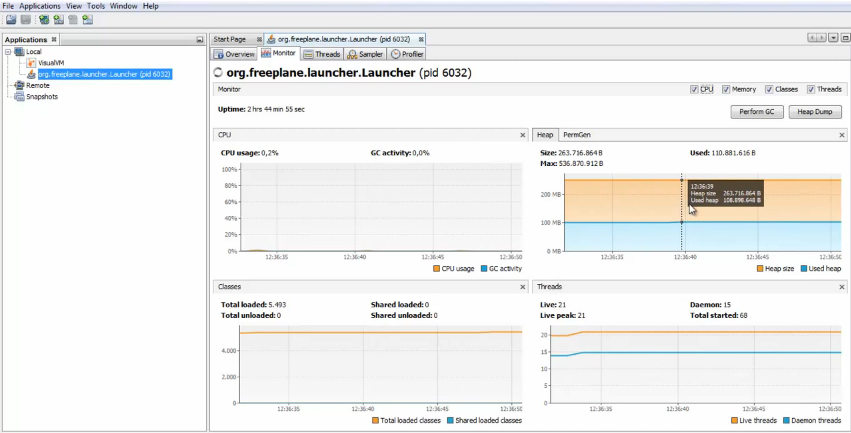
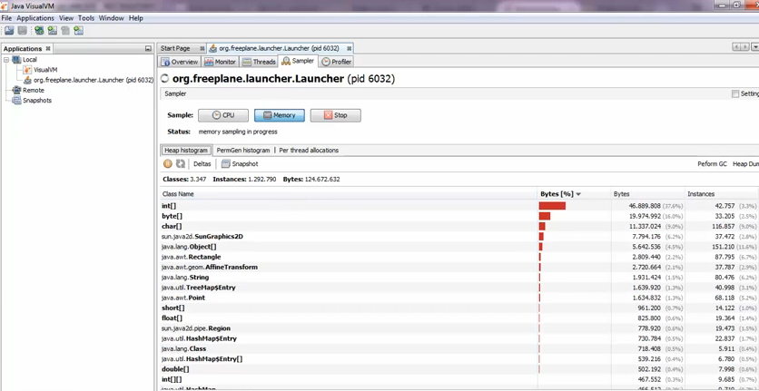
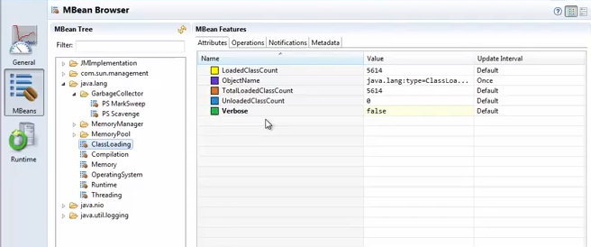



Using **VisualVM** we can view detailed information about Java applications while they are running on a Java Virtual Machine.  
**VisualVM** allows us to generate and analyze <code>heap data</code>, track down <code>memory leaks</code>, monitor the <code>garbage collector</code> and perform <code>memory</code> and <code>CPU</code> profiling.

<!-- more -->

### **VisualVm**

#### How?

To run it, just click on the jvisualvm.exe icon.All Java applications running will be displayed on the right hand side navigation bar. There are four tabs available for our applications: <code>Overview, Monitor, Threads, Profiler</code>.

 **VisualVM tab monitor** follows the CPU and memory usage of our applications,so we can see if our application takes too much CPU or if there is too much memory used by the application.

 The most interesting tab is the **Profiler** one.We must start one kind of profiling before seeing any information.We will start with *Memory profiling*.Just click on the <code>Memory button</code> and the instrumentation will start.During the instrumentation, the application will be blocked.
 

*We can see that this application stores some big int[] and byte[] arrays.*

### **VMX**

**VMX** provides an architecture to manage resources dynamically at runtime.It is used mostly in enterprise applications to <code>make the system configurable</code> or to <code>get the state of application</code> at any point of time.

 

