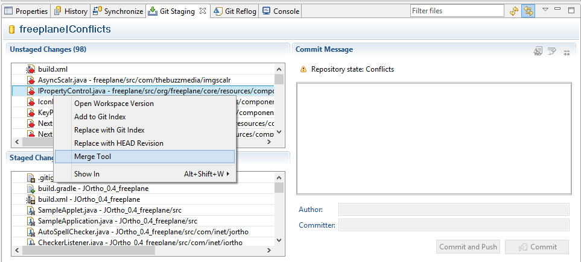

#What is a merge conflict?

Sometimes you get **merge conflicts** when merging or pulling from a branch. A merge conflict usually occurs when the same file from the two different branches that you are trying to merge were modified in the same _area_.

Git will tell you that you have conflicts, and will also tell you that you have to **fix** them and then **commit** the result. So how do we fix conflicts?

<!-- more -->

The conflicting files appear in the <strong>Unstaged Changes</strong> section. Note that they have a red bullet on their icon.

#How we fix conflicts?

To fix conflicts, we will use the merge tool from Git Staing view.

The blue changes are non-conflicting and can be merged automatically. The red ones are conflicting and we must fix them.

<strong>Hint:</strong>The first thing we have to do is to press the Copy all non-conflicting changes button from top-right area of the merge tool view. This will automatically merge all the non-conflicting changes.

After that, all you have to do is to modify the conflicting method in the desired way.

Usually, when conflicts occur, it is recommended to talk with the author of the code.

A particular type of conflict occurs when you try to modify a file that was deleted on the other branch. In this case, it is mandatory to talk with the person who removed it and to figure out where to put your code instead. This also applies if you delete a file and another user tries to modify it.

After you fixed the conflict, you have to save the file, return to the **Git Staging View** and drag and drop the conflicting file to the **Staged Changes** category. Then you can finally make your commit.

<strong>Be careful!</strong> Sometimes, the merge can fail. When this happens, it is recommended to <strong>reset</strong> the repository.

