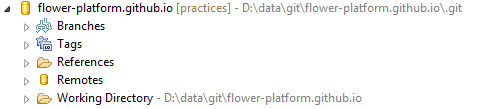
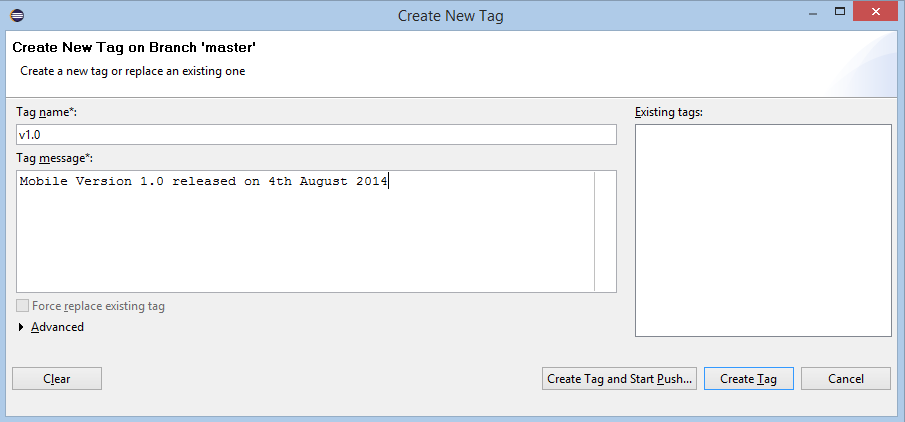
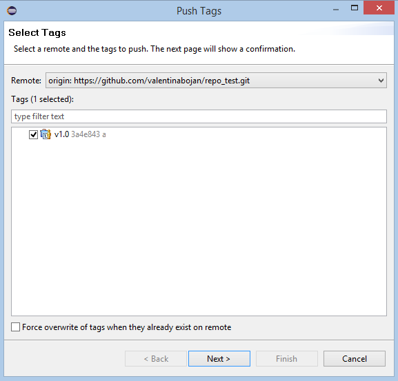
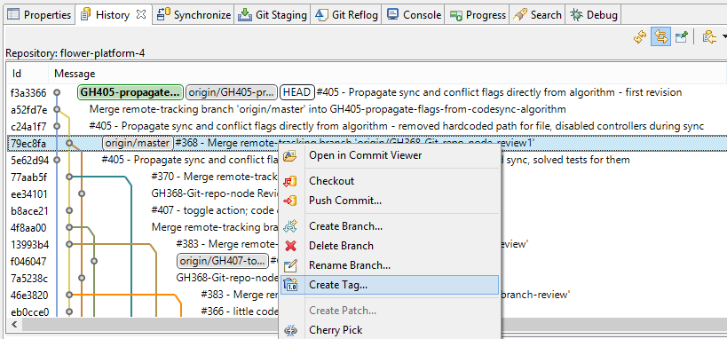
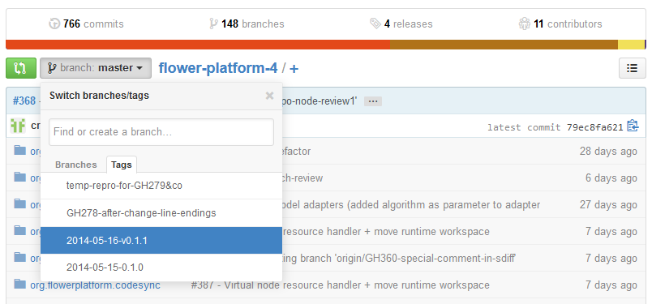



## Why?

Among many other features, **Git** provides us the ability of using **tags**. A tag can be used in different cases such as:

* marking a **release version** of our code;
* identifying a **certain** important **commit** in our git history. 

A tag can be seen like a label for a commit, because it contains a name (e.g. ``v1.0``) which identify the commit or the released version and a descriptive message (e.g. ``Mobile Version 1.0 released on 4th August 2014``).

## How?

<!-- more -->

To create a new tag, we must perform the following steps:

* <i>Switch to the [Git perspective](git-perspective.html)</i> in the Eclipse IDE.

* <i>Double click on the repository</i> where we want to create the tag. After that operation, we will obtain the following hierarchy:
	
	
* <i>Checkout the desired branch</i> and then, in the hierarchy, <i>left click</i> ``Tags / Create Tag...``. In the opened window, we can enter the name of the new tag, as well as the related message, as we have just talked before.
	
	
* After completing all the information, we have to <i>choose one of the following options:</i>
	* <i><b>CreateTag and Start Push...</b></i>
		* the new tag will be *automatically pushed* on the remote branch.
	* <i><b>Create Tag</b></i>
		* the new tag must *manually* be *pushed* on the remote branch. For this action, in the previous hierarchy, <i>left click</i> ``Tags / Push Tags...``. In the *Push Tags* window we <i>select the tags that we want to push</i> on a remote branch and then we press ``Next -> Finish -> Ok``.
		
		

<strong>Warning!</strong> If we create a tag using the method presented above, then the commit identified by the new tag will be the commit which is the HEAD of the selected branch. <b>To create a tag for a specific commit:</b>
	<ul>
		<li class="circle">In the <a href="git-perspective.html">Git perspective</a>, <i>switch</i> to the <a href="history.html">History view</a>;</li>
		<li class="circle"><i>Right click on the desired commit</i> and select Create Tag....</li>
	</ul>
The next steps are those that we have already discussed.

## Get a file from a specific revision

After we create tags, we can **find** a file from a **specific revision**, or a **tagged commit**. To do that:

* On our repository page from [Github](http://www.github.com), <i>left click the down arrow</i> from the branch: <b>master</b> tab;
* In the drop down menu, <i>switch</i> to the Tags tab and choose the wanted tag. 

