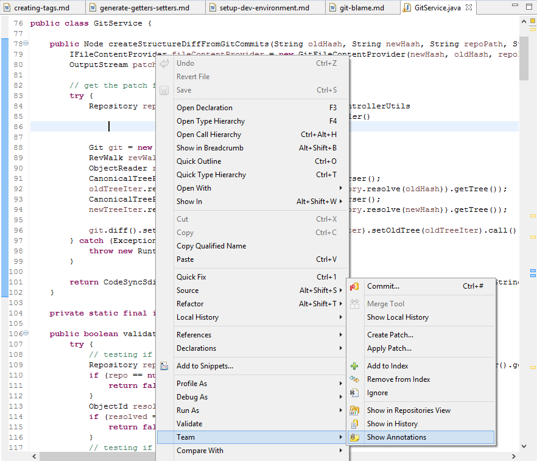
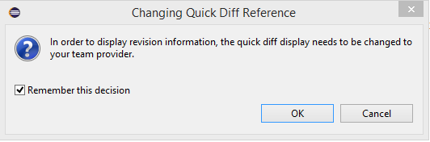
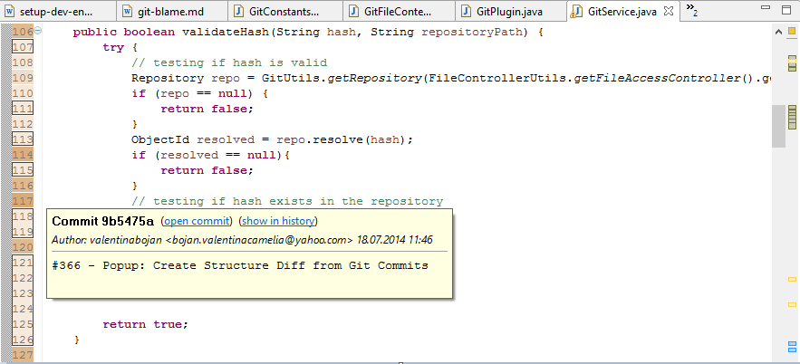



## Why?

As most of the version control systems, **Git** embrace the idea of **blame**. This concept is very useful when a project is developed by more than two programmers, because in these cases there can be even methods to whom implementation have contributed **many developers**. We use git blame every time we want to figure out who committed a bug or who implement efficiently a method. Not in so many words, Git blame option gives us the possibility to see, **for every line of a file**:

* who is its **author** (e.g. ``paul-smith``);
* **when** it was **modified** (e.g. ``29.07.2014 17:40``);
* in which **commit** it was modified (e.g. ``Commit a51f6fd``).

## How?

<!-- more -->

To see the authors of a certain file using git blame, we must perform the following steps:

* <i>Open the file</i> in the Eclipse IDE.

* <i>Right click</i> anywhere in the <b>Source View</b> and choose ``Team / Show Annotations``

 

* <i>Select</i> Ok in the popup window that appears. We will see a <b>coloured rectangle</b> in front of every line from our file.

 

* <i>Move the cursor</i> of the mouse <i>on the rectangle</i> corresponding to the line that we want to inspect. We will obtain all the <b>details</b> that we have been looking for, such as the author, the commit, the date modified.	

 

<strong>Note:</strong> Notice that once we are with the cursor above a rectangle, other <b>rectangles</b> with the same color are suddenly receiving a <b>black border</b>. This means that the <b>lines</b> corresponding to those rectangles have the <b>same features</b> as the inspected line.

<strong>Hint!</strong> We can obtain the <b>same result</b> if we <i>right click</i> anywhere in the vertical bar in front of the code lines (the vertical bar which contains the line numbers or the code folding buttons) and choose Show Annotations.
