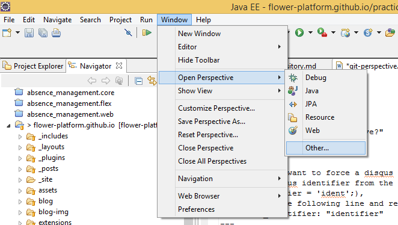
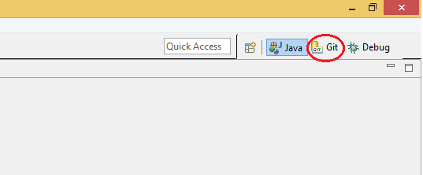

## How?
All the Git commands can be easily executed right from Eclipse, using the Git Perspective. In order to open the Git perspective, you have to choose the **Open perspective** option from the **Window** menu and to select **Git** from the **Other** section.

<!-- more -->

<strong>Hint:</strong> Once you open a perspective once, Eclipse will remember it and will display it in the top-right corner. Also, you can switch the perspective using the <strong>Open Perspective</strong> button. 
