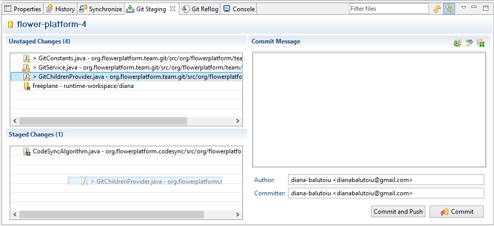

Whenever you modify a file from your working directory, a  >   sign will appear in front of it in the Project Explorer/ Navigator view (it will propagate up to it`s root directory). This means that it was modified after the last commit was made.

<!-- more -->

All the files that were modified will appear in the Git Staging view from the **Git perspective**.

Here they can be split into two categories:
<ul>
	<li><strong>Unstaged changes:</strong> changes that will not be included in the commit.</li>
	<li><strong>Staged changes:</strong> changes that are ready to be committed.</li>
</ul> 

You can <strong>drag and drop</strong> them from one category to another. Note how the file`s icon changed!

<strong>Attention:</strong>The unstaged changes will not appear into the commit! So make sure that you staged all the changes that you need before committing!

You can commit your changes by pressing the Commit button from the bottom-down corner of the Git Staging view.

You can also commit and push by pressing the Commit and Push button.

<strong>Attention:</strong>You must assign a message to the commit. It should contain a short and clear description of what the commit is about.

