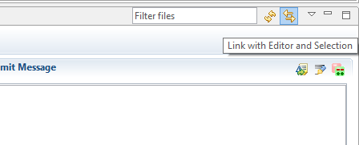

#What is History View?

The History View is a commit-centric view of the resources in a given Repository.

<!-- more -->

You can open it in the Git Perspective by clicking <strong>Window</strong> > <strong>Show View</strong> > <strong>Other...</strong>, then <strong>Team</strong> > <strong>History</strong>.

#Commit Graph

The Commit Graph area is the main part of the History View

Each line in the Commit Graph corresponds to a commit. Branches, tags and HEAD are visualized as follows:

<ul>
    <li>The peaks of <strong>local branches</strong> are shown as green rectangles</li>
    <li>The peaks of <strong>remote branches</strong> are shown as grey rectangles</li>
    <li><strong>HEAD</strong> is shown as a white rectangle</li>
    <li><strong>Tags</strong> are shown as yellow rectangles</li> 
</ul>

#Actions that can be performed from the History View

 
You can perform many tasks form the **History View**, such as:

<ul>
	<li>Inspecting the change history of a particular file from the repository</li>
	<li>Search for a commit</li>
	<li>Display details about a commit, like author, modified files, commit message</li>
	<li>Check-out of a certain commit</li>
	<li>Create/delete branches and tags</li>
	<li>Reset the repository to a certain commit</li>
	<li>Merge branches</li>
</ul>

<strong>Hint:</strong>It is recommended to have the Link with Editor and Selection button pressed. This way, the History View will be  synchronised with the <strong>Repositories Navigator</strong> and with the current selection from it. 

