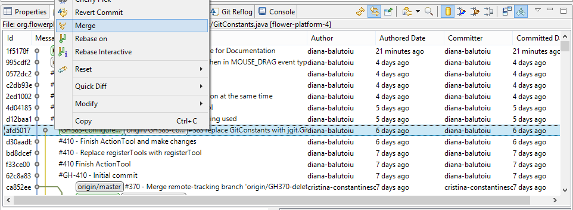

#What does merge mean?

A merge incorporates changes from another branch or tag, since the time their histories diverged from the current branch, into the currently checked out branch.

#How?

There are tree ways to trigger merge:

<ul>
	<li>from the <strong>History View</strong> </li>
	<li>from the <strong>Team menu</strong> </li>
	<li>from the <strong>Git Repositories View</strong> </li>
</ul>

<!-- more -->

#Starting merge from the History View 

Ensure that the toggle button Show all Branches and Tags is selected in the History View's toolbar. This ensures that you see the complete history of your repository in order to decide which branch you want to merge. Select the commit with the branch or tag label you want to merge and click  Merge.

 
#Starting merge from Team Menu

In the Package Explorer or Navigator, open the context menu on a project node. Select **Team** > **Merge...**

Select a branch or a tag you want to merge with your current branch. This dialog also allows you to select merge squash and fast-forward options.

# Starting merge from the Git Repositories View

You can trigger a merge from any branch and tag node and from the repository node if you have checked out a local branch. You just have to right-click the branch you want to merge with and choose the merge option.

<strong>Attention:</strong> Some merges can`t be performed directly from Eclipse! When that happens, you must use Git Bash or Git GUI.

