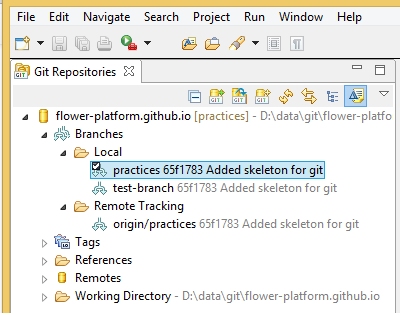
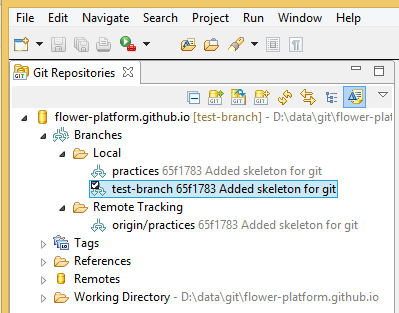
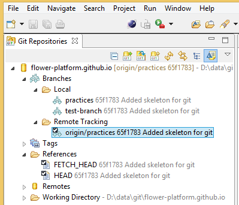



**Git** is a distributed version control system which consists of a database of **commits**. When working with Git and want to create a **new project** we shouldn't put it in the **workspace** but in a different place (``e.g. D:\data\git\flower-platform.github.io``). In this case, the workspace is used by Eclipse only to keep the **metadata**.

A **Git repository** is stored in a directory called ``.git.`` The projects from the same directory as ``.git`` represents the **working directory** which stores the appropriate files of a **branch** (A branch in Git is a reference to a commit). This is a **checked out branch**. 

There are two types of branches: **locals and remotes**.

We always work on a **local branch** (the checked out branch). Only **one** branch could be checked out **at a time**.

<strong>Attention:</strong> We could checkout a remote branch to take a look, but we cannot modify it!
