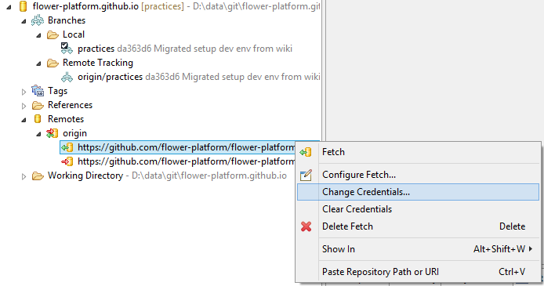



Sometimes it may happen that we mistype the credentials when doing a **push** or a **fetch**. Git won't let us entering the password for a second time, in which case we need to reset our password. This can be done by:

<!-- more -->

* expanding **Remotes** folder
* expanding the Remote folder used to manage the repository 
* right-clicking on the URI used for **push / fetch** 
* choosing **Change credentials**
* in the popup that appears, simply enter the password in the texinput

 
