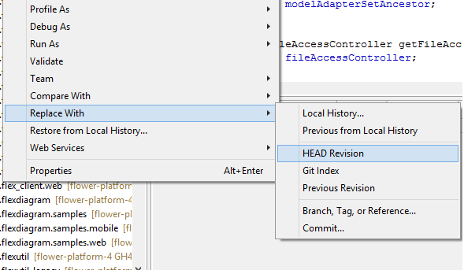

#Why?

Sometimes you need to undo **all** the changes that you have made, sometimes just **some** of them.

#Reset

The reset command removes all the changes.

To reset: Right-click on the repository, choose the **reset** option, then choose the reset point and the reset type (usually choose **HARD**, this will remove all the changes).

<!-- more -->

<strong>Attention:</strong>Reset will undo all the changes from the <strong>entire</strong> current repository!

#Replace

When you want to undo only the changes from some particular files, you can use replace instead.

To replace: Right-click on the file that contains the changes you want to undo/Replace with/HEAD revision

